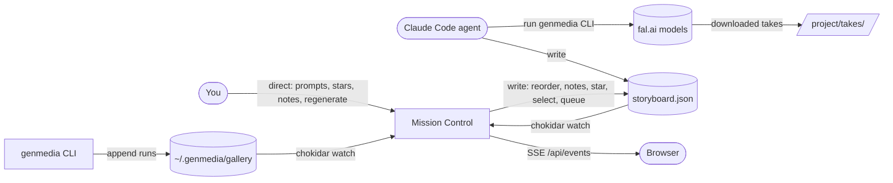

# Mission Control

**A shared canvas for directing AI film production.** You describe the shots; a
Claude Code agent generates them with the [`genmedia`](https://www.npmjs.com/package/@fal-ai/genmedia-cli)
CLI (fal.ai models); Mission Control is the live board where the two of you meet
— scenes, takes, stars, notes, and a final cut you can export. It is **not** a
video editor. The human directs, Claude generates, and Mission Control keeps
everyone looking at the same storyboard in real time.

The trick: there's **no database and no backend of record**. State lives in two
places on disk — a `storyboard.json` you and Claude both edit, and the read-only
generation gallery the CLI already writes. Mission Control watches those files
and re-renders the moment either side changes.

_(The app/package is `genmedia-ui`; "Mission Control" is the product name.)_

---

## Quickstart

**Prerequisites**

- [Bun](https://bun.sh) (package manager and script runner).
- The `genmedia` CLI on your `PATH`, authenticated with a fal.ai key:
  ```bash
  npm install -g @fal-ai/genmedia-cli   # provides the `genmedia` command
  genmedia setup                        # interactive; stores your fal.ai key
  # agents/CI: genmedia setup --non-interactive --api-key "$FAL_KEY"
  ```
  Get a key at <https://fal.ai/dashboard/keys>. Mission Control shells out to
  `genmedia` for model schemas and job status, so it must be installed and
  working first.

**Run it**

```bash
bun install
GENMEDIA_UI_PROJECT=/path/to/your/project bun run dev
# → http://localhost:3000  (Vite auto-picks the next free port — e.g. 3001 —
#   if 3000 is busy; watch the terminal for the actual URL)
```

`GENMEDIA_UI_PROJECT` is the project directory that holds `storyboard.json` and
the downloaded `takes/` (defaults to the current working directory if unset).
Point a Claude Code agent at that **same** directory, install the companion
[`storyboard` skill](#the-storyboard-skill), and let it drive the `genmedia`
CLI — as it generates, the board fills in.

> Want to see it immediately? This repo ships a finished example in
> [`demo/`](./demo) (the "Lighthouse Teaser", with pre-generated takes). Run
> `GENMEDIA_UI_PROJECT=$(pwd)/demo bun run dev` and open the board.

**Environment variables**

| Variable              | Purpose                                          | Default               |
| --------------------- | ------------------------------------------------ | --------------------- |
| `GENMEDIA_UI_PROJECT` | Project dir holding `storyboard.json` + `takes/` | current working dir   |
| `GENMEDIA_UI_GALLERY` | The genmedia gallery to read runs from           | `~/.genmedia/gallery` |

---

## How it fits together



- **No database.** The filesystem is the state layer:
  - `storyboard.json` (in your project dir) is the shared intent — scenes,
    order, prompts, selected take per scene, stars, notes, and a UI→Claude
    request queue. **Both** the app and the Claude agent write it, so every write
    is atomic (temp file + rename) and guarded by optimistic concurrency
    (`updateStoryboard` rejects a write whose base moved underneath it, and
    serializes same-process writes through an in-process chain).
  - The genmedia **gallery** (`~/.genmedia/gallery/sessions/<id>/data.json` +
    `last-session.json`) is owned by the CLI and treated as **read-only** — the
    app re-reads the whole file on change.
- **Live updates.** A single server-side [chokidar](https://github.com/paulmillr/chokidar)
  watcher tracks the gallery and `storyboard.json`; changes are pushed to the
  browser over Server-Sent Events (`/api/events`), and the client invalidates
  exactly the affected TanStack Query caches. Media is streamed with HTTP range
  support through `/api/media`.
- **Stack.** [TanStack Start](https://tanstack.com/start) (SSR, file-based
  routing) on Vite + Nitro, TanStack Query for data, Tailwind CSS 4 + shadcn/ui,
  React 19, TypeScript. Deliberately strict: no `any`, no non-null assertions,
  `noUncheckedIndexedAccess` on, oxlint (type-aware) + oxfmt. See
  [`CLAUDE.md`](./CLAUDE.md) for the full contract.

---

## Feature tour

### Mission Control (the board)

The home route is a live dashboard over one genmedia session:

- **Storyboard board** — a horizontal row of scene cards. Drag to reorder
  (persists to `storyboard.json`); each card shows its status, prompt, take
  count, and a **Notes for Claude** box. A **Regenerate** button on each card
  queues a direction request (with the current note) for Claude, and the card
  shows a "queued for Claude" hint until the agent drains it. A `needs-review`
  status is the beacon that Claude just delivered takes and it's your turn.
- **Runs feed** — the session's generations, newest first, updating live as the
  CLI produces them. Drag a run onto a scene card to attach it as a take; runs
  tagged with a scene id (via the CLI download convention) show that association.
- **Pending jobs** — async generations Claude has started (recorded in the
  storyboard) show as in-flight, polled server-side via `genmedia status`.
- **Session picker** — switch between genmedia sessions.

### Version flipper

Click a scene's thumbnail to open a full-screen, **keyboard-first** take viewer
(`/scene/$sceneId`, deep-linkable to a specific take with `?take=`):

| Key       | Action                                                                        |
| --------- | ----------------------------------------------------------------------------- |
| `←` / `→` | flip to the previous / next take (neighbours preloaded, so it's instant)      |
| `space`   | star / unstar the current take                                                |
| `enter`   | select the current take (marks the scene `ready`)                             |
| `c`       | compare the current take against the selection, side-by-side, playback synced |
| `p`       | play / pause (in compare)                                                     |
| `esc`     | exit compare, or return to the board                                          |

Stars and selection write through to `storyboard.json` optimistically, so the
board reflects your choice the instant you press a key — and Claude sees it too.

### Sequence player & export

Once any scene has a take, a **Play sequence** button opens `/sequence`: the
selected take of each scene played back to back as one cut, with a scrubber
showing scene boundaries and keyboard controls (`space` play/pause, `←`/`→`
scene, `m` mute, `esc` back). Broken/missing clips are skipped with a toast, not
a hang.

**Export** stitches those selected takes into a single downloadable `.mp4`,
concatenated **entirely client-side** (WebCodecs via mediabunny) — uniform clips
are transmuxed losslessly, mixed clips are re-encoded, and audio tracks are muxed
in. No server round-trip, no `ffmpeg.wasm`.

### Closing the loop with Claude

The **Regenerate** button (above) writes a structured request into
`storyboard.json`'s `requests[]` queue. The companion `storyboard` skill teaches
Claude to re-read the board before generating, drain that queue, treat your notes
and un-starred takes as direction, and regenerate **only** the scenes you flagged
— then set them back to `needs-review` for your next pass. That's the full loop:
you direct in the UI, Claude generates, and you're always looking at the same
board.

---

## The `storyboard` skill

`docs/skill/storyboard/` is the contract that teaches a Claude Code agent how to
collaborate with the board — the schema, the `takes/<scene-id>/` download
convention, async job tracking, and the drain-the-direction-queue habit. Install
it alongside the CLI's own `genmedia` skill:

```
# One-liner, straight from GitHub (inside Claude Code):
/plugin marketplace add tombeckenham/genmedia-ui
/plugin install storyboard@genmedia-ui
```

```bash
# Or copy the folder:
cp -r docs/skill/storyboard ~/.claude/skills/          # user-level, or
cp -r docs/skill/storyboard /path/to/project/.claude/skills/   # project-level
```

The skill is plain `SKILL.md` (an open format), so it also works in other
agents — `~/.codex/skills/` for OpenAI Codex, `~/.grok/skills/` for Grok Build
(which also reads Claude Code skill locations directly). See
[docs/skill/README.md](./docs/skill/README.md).

See [`docs/skill/README.md`](./docs/skill/README.md) for details.

---

## Development

```bash
bun install
bun run dev            # dev server (http://localhost:3000, or next free port)
bun run build          # production build (vite + nitro)
bun run typecheck      # tsc, no emit
bun run lint           # oxlint --type-aware
bun run test           # vitest
bun run format         # oxfmt + oxlint --fix
bun run generate-routes # regenerate src/routeTree.gen.ts after adding a route
```

The routing/query architecture and the (non-negotiable) strictness rules are
documented in [`CLAUDE.md`](./CLAUDE.md).
